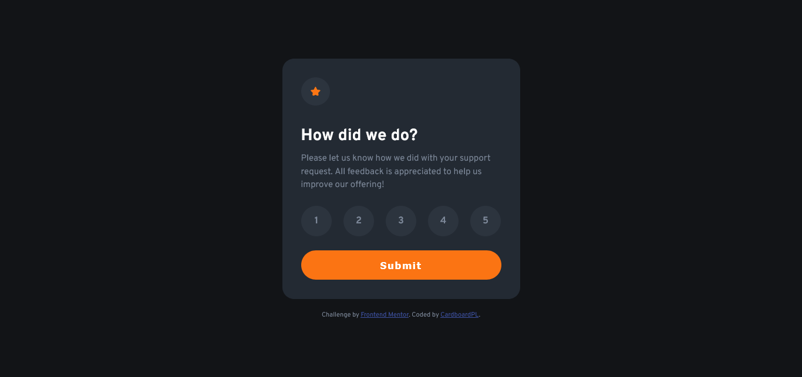
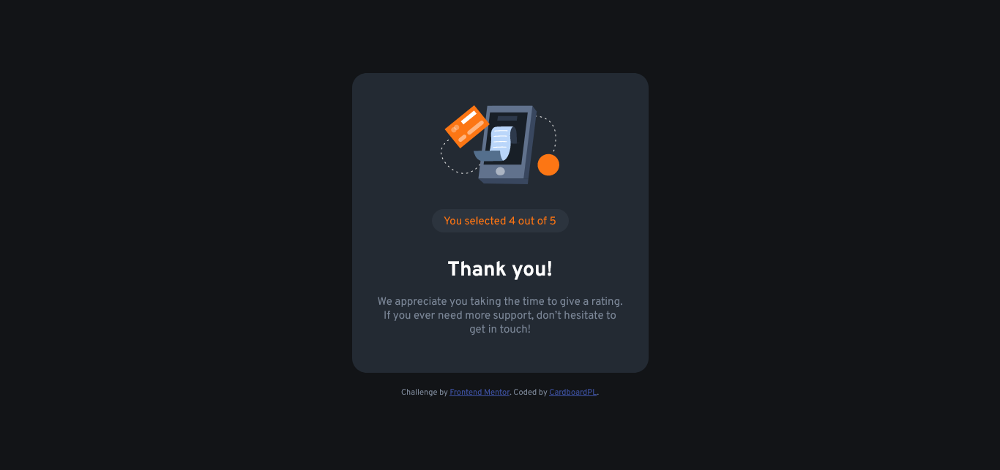
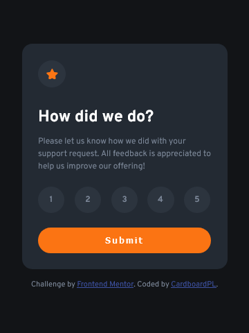
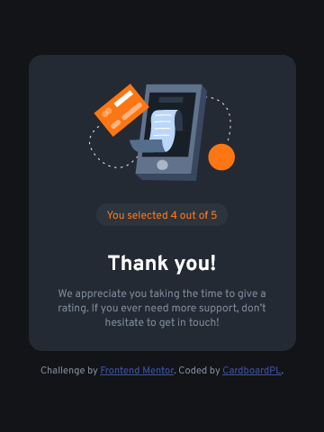

# Frontend Mentor - Interactive rating component solution

This is a solution to the [Interactive rating component challenge on Frontend Mentor](https://www.frontendmentor.io/challenges/interactive-rating-component-koxpeBUmI). Frontend Mentor challenges help you improve your coding skills by building realistic projects. 

## Table of contents

- [Overview](#overview)
  - [The challenge](#the-challenge)
  - [Screenshot](#screenshot)
  - [Links](#links)
- [My process](#my-process)
  - [Built with](#built-with)
  - [What I learned](#what-i-learned)
  - [Continued development](#continued-development)
  - [Useful resources](#useful-resources)
- [Author](#author)

## Overview

### The challenge

Users should be able to:

- View the optimal layout for the app depending on their device's screen size
- See hover states for all interactive elements on the page
- Select and submit a number rating
- See the "Thank you" card state after submitting a rating

### Screenshot

### Links

- Solution URL: [GitHub Repo](https://github.com/CardboardPL/Frontend-Mentor-Interactive-rating-component)
- Live Site URL: [GitHub Pages](https://cardboardpl.github.io/Frontend-Mentor-Interactive-rating-component/)

## My process

### Built with

- Semantic HTML5 markup
- Flexbox
- Desktop-first workflow
- Javascript

### What I learned

I learned and applied it to a lot of stuff such as using the adjacent element selector which helped me select the buttons and apply the selected styling if their respective radio button was selected. I also learned about
the weird default styling of the legend in a fieldset and yeah.

### Continued development

I plan to use this as an inspiration for my future projects.

### Useful resources

- [W3Schools CSS selector reference](https://www.w3schools.com/cssref/css_selectors.php) - This helped me remember the specific selectors I needed.

## Author

- Frontend Mentor - [@CardboardPL](https://www.frontendmentor.io/profile/CardboardPL)
- Twitter - [@SirPLWasTaken](https://www.twitter.com/SirPLWasTaken)
